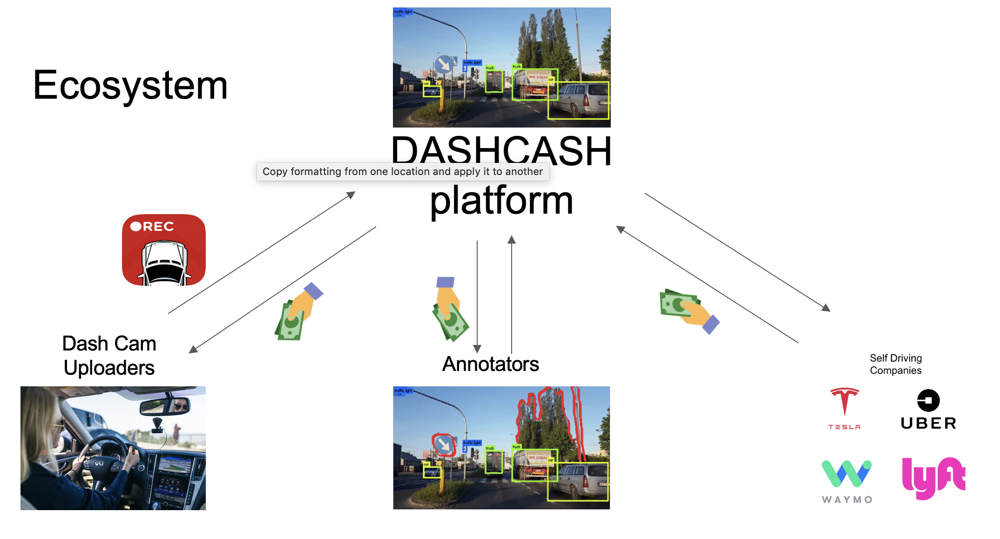
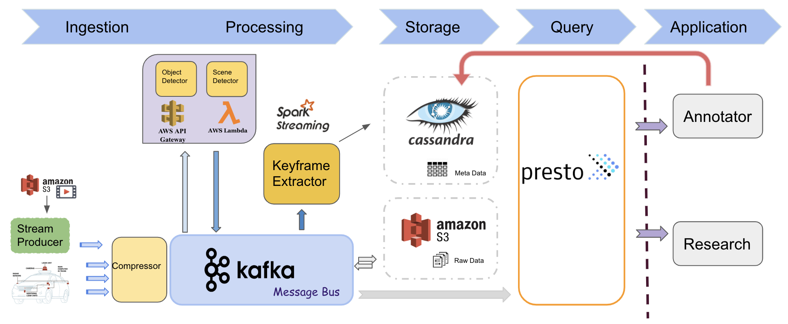
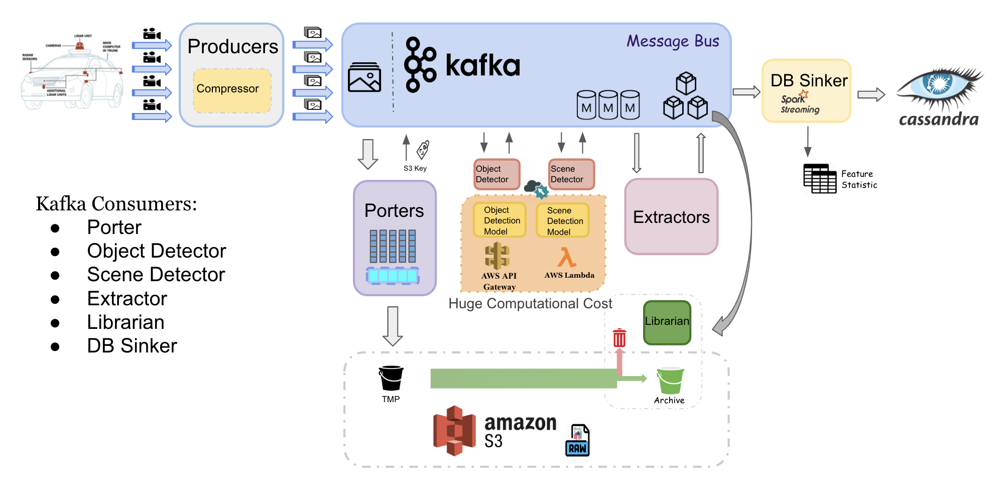
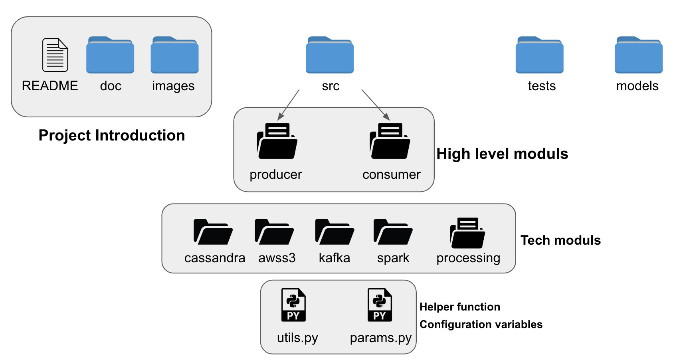

# DASHCASH/CarsMemory

## Introduction

The prosperity of autonomous vehicle carries huge chances and challenges, research teams are in great need of diverse labeling dataset, which brings four challenges for data engineering.

* **Data Acquisition**: How to get diverse data sources?
* **Data Storage**: How to decrease data redundancy?
* **Data Management**: How to support scene selection for research teams?
* **Data Labeling**: How to decrease the load for manual annotation?

Our project try to build a data engineering system ingests real-time streaming data from common cars' dash cam, then uses build-in ML model to auto-annotate the video and extract keyframes that are significant for a manual annotator to check.

This platform could:
1. Greatly speed up the human labeling process
2. Using metadata (auto and manual labeled) to manage collected data's diversity and quality
3. Finally being able to support the datasets demand of self-driving car field's development

## Engineering

### Dataset

During development period, we use [BDD100K](https://bdd-data.berkeley.edu/) dataset published by Berkeley Deep Driver to simulate real-time video streaming for testing purpose.

This dataset includes about 1.8 TB driving camera recorded videos.

Finally, from a production perspective, we plan to realize connecting the system input with real car's dash cam and support user upload their records by directly upload video files.

### Tech Stack

1. Kafka: used as message bus to transmit stream data to different processing units, and it helps decouple modules to make the architecture flexible when adding new functions.
2. Spark Streaming: used to process streaming data which are metadata describing the frames of videos.
3. AWS Lambda and API Gateway: used to deploy high computational cost modules, which could greatly reduce the load for our processing cluster and it's efficient.
4. AWS S3: used to store raw data, frames of videos.
5. Cassandra: used to store metadata describing the frames, which need to support huge volumes of data ingestion, and Cassandra is an efficient write-oriented database and really good with time-series data.
6. Presto: used to access and gathering data from multiple data storage media efficiently.
7. Flask: as user interface used for showing dashboard.

### Engineering Challenges

1. Solving the latency problem during high throughput period
  * Using Kafka's partition and consumer groups property
  * Deploy modules with huge computational cost on AWS Lambda as API
  * (Next) Auto scaling on consumers

2.  Maintain the diversity of dataset
  * Generate data's feature distribution statistic during streaming processing stage
  * Selectively archive data according to the feature distribution report

About figure shows the detail design for solving these two challenges.

**Some facts about the challenges we encountered**
1. The incoming video streaming has huge throughput, the size of frames is large than normal text files.
2. Object and Scene detection models costs huge computational power, it's a bottle neck causing the latency problem. And after calculating the expenditure based on possible throughput for real project, we think it more efficient to use AWS Lambda wrapped as API. Which will have about 10s latency for each images.
3. Not all input data are valuable for research, and it will cost so many space to maintain all data.

**How consumers workers to tackle challenges**

* Porter: store the raw image on S3 (a temporary bucket) and get the key to access the data. It is a very large consumer group consume data on topic with many partitions. Used to decrease the volume load of later messages.
* Object and Scene Detector: request Object detection API to get metadata about objects in frames. The related topic partition and consumer group size about $FPS * Lentecy$ which could avoid the waiting of incoming data.
* Extractor: find keyframes for human manual checking and also in charge of judge whether the frames is valuable enough for archiving according to meta data.
* Librarian: move valuable raw data from temporary bucket to archive, and delete others.
* DB Sinker: taking charge of storing metadata into database and generate the report.

In summary:

**Decreasing latency**: Porter, Detectors

**Speeding up labeling**: Detectors, Extractor

**For dataset diversity**: Extractor, Librarian, DB Sinker

### Project File Architecture

Above shows how the project code base is arranged.

### Setup

For more details, look [here](./docs/setup.md).
