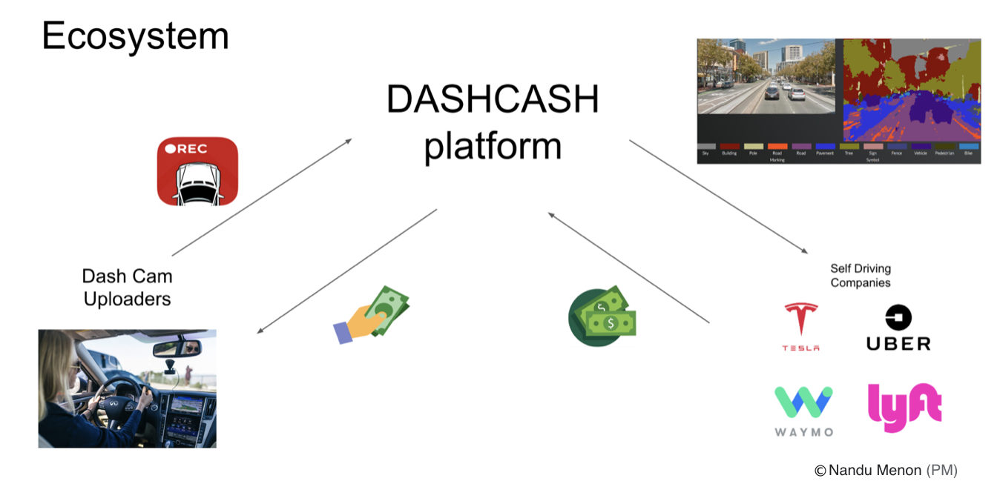

# Cars Memory

## Background

Autonomous vehicles keep generating a large amount of diverse sensor data, accompanied with four challenges for data engineering.

* **Data Acquisition**: How to gain more various data while eliminate data redundancy?
* **Data Storage**: How to clean data? And how to store annotations?
* **Data Management**: How to support scene selection for research teams?
* **Data Labeling**: How to decrease the load for manual annotation?

In a word, there are tons of data engineering functions in demand within this data ecosystem.

### Business Value

According to the business value analysis offered by our PM, our platform's main goal is to server self-driving research organization's requirement of high quality annotated data.

So the prior function of this data engineering project is to **speed up manual data labeling** and implement related architecture for **data management**.

## Engineering

### Dataset

There are sufficient datasets to support test for batch processing and streaming processing, which related to different ways of data gathering in real-world.

* For batch processing: (Recorded data upload method)
  * [BDD100K](https://bdd-data.berkeley.edu/)
  * All camera vedios
  * Size: ~ 1.8 TB
  * Directly download
  * This could also be set as streaming for testing
* For streaming processing: (IoT upload method)
  * [nuScenes](https://www.nuscenes.org/download)
  * Synchronized multi-type sensor dataset
  * Size: ~ 30 GB keyframes for 20 hours driving
  * Directly download

### How to realized the prior functions?

**Speed up manual data labeling:**

After data ingestion:
1. Use build-in machine learning models to do image processing like "object detection" and get the annotation.
2. Along with the time series, we try to find closest keyframes that has difference on annotation.
3. (Advance) Add fusion function with LIDAR, RADAR data to improve the precision of object detection, which need synchronize and join of multiple data source.

During the manual annotating period:
1. Only keyframes need to be check by human, and if one object's annotation was changed, all related annotations in later frames that have this object should change.
2. (Advance) We try to make the annotation period more like a game, using tween animation to make the change between keyframes more smooth, thus need quick update on annotations.

**For data management:**

* Store more information about each video, like whether condition, traffic load, etc.

### Tech Stack

(May change after more specified comparison)

### Engineering Challenges

* Ingestion and join data of different type
* Computer vision and multi-sensor fusion in processing
* Management of media data with various annotation
* Need to cut video (from batch and stream) into piece and take care the storage.

## MVP and more

**V0.1** Batch processing + Storage + Query engine + Annotator Loop

**V0.2** + Streaming processing (no fusion)

**V0.3** + Streaming processing (with fusion)

**V1.0** + More classification to support scene selection to get datasets for research use.

---

**Then we consider more functions based on these questions if we have time left:**

Q1: What if some of the user upload bad data.

**V1.1** + Add a detector and filter before processing to clean unqualified data.

Q2: How to differentiate the values of data?

A2: We could emphasis those data in special scene, and those data have more false object detection by build-in model.

Q3: Could we make better use of the annotator feedback?

A3: We may also record the precision and recall rate of manual annotation to get a report to detect the build-in model's weakness in terms of driving scene.

Q4: How to simulate manual annotator?

A4: We use a worse ML model as the build-in model for processing, then use a better model as annotator to do scale up the whole pipeline. If we were using annotated dataset to test, we could just use the right annotation to compare.

**V1.2** + Simulated manual annotator at the application

**V1.3** + Record and analysis the feedback to evaluate the build-in model

**V1.4** + Add value evaluation after processing

Q5: How to eliminate the data redundancy?

**V1.5** + Add one layer between value evaluation module and storage layer to filter those common data that current data are good at.

Q6: Could we try to refine the build-in model like in a research domain?

**V2.0** + Make it more flexible to train, test and set the build-in model.

**V3.0** + Privacy Protection
