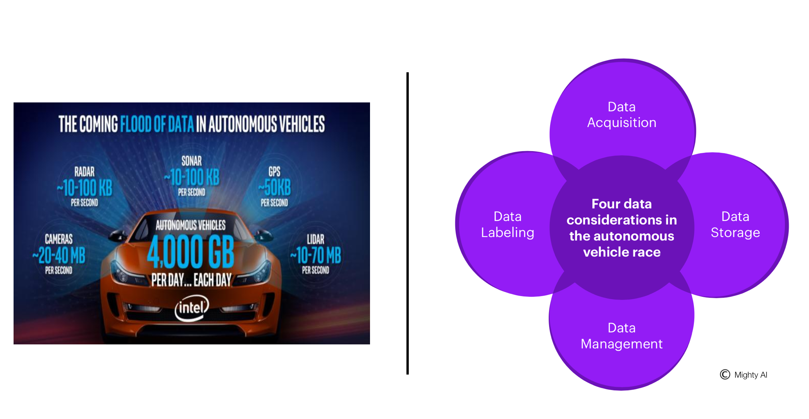
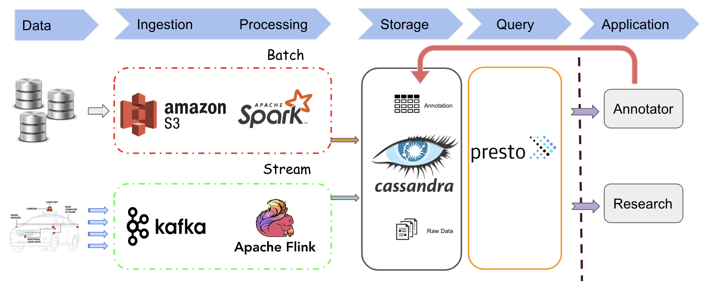

# DASHCASH/CarsMemory

## Introduction

Autonomous vehicles keep generating a large amount of diverse sensor data, accompanied with four challenges for data engineering.

* **Data Acquisition**: How to gain more various data while eliminate data redundancy?
* **Data Storage**: How to clean data? And how to store annotations?
* **Data Management**: How to support scene selection for research teams?
* **Data Labeling**: How to decrease the load for manual annotation?

Our project is a data engineering system ingests real-time streaming data from common cars' driving recorders, then uses object detection model to auto-annotate the video and extract keyframes that are significant for a manual check. This platform could greatly speed up the labeling process, and with multiple metadata generated during different stages, we could manage collected data's diversity and quality, then make it a data ecosystem to support the data demand of self-driving car field's development.

## Engineering

### Dataset

There are sufficient datasets to support test for batch processing and streaming processing, which related to different ways of data gathering in real-world.

* For batch processing: (Recorded data upload method)
  * [BDD100K](https://bdd-data.berkeley.edu/)
  * All camera vedios
  * Size: ~ 1.8 TB
  * Directly download
  * This could also be set as streaming for testing
* For streaming processing: (IoT upload method)
  * [nuScenes](https://www.nuscenes.org/download)
  * Synchronized multi-type sensor dataset
  * Size: ~ 30 GB keyframes for 20 hours driving
  * Directly download

### Tech Stack

### Engineering Challenges

* Ingestion and join data of different type
* Management of media data with various meta-data
